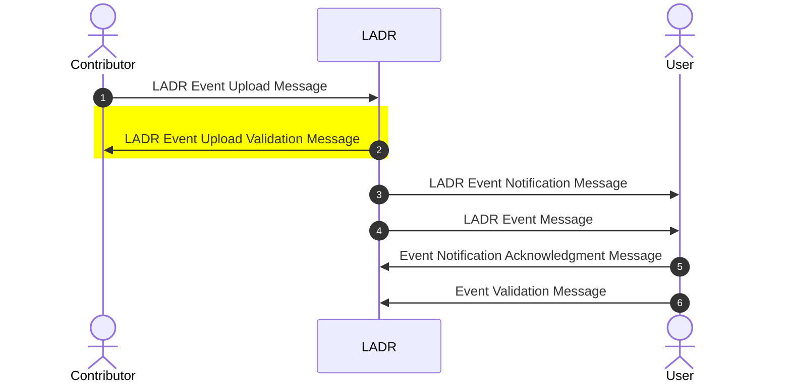
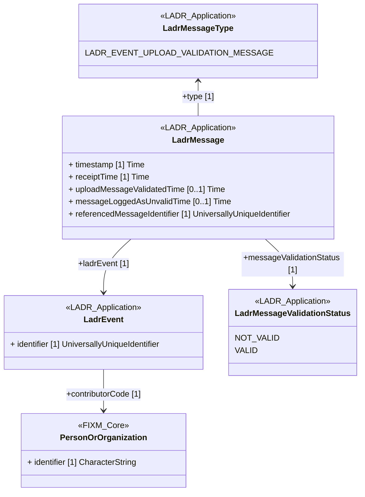

# LADR Event Upload Validation Message

## XML schema and samples

- Go to [Schema definition](https://github.com/hlepori/test_ladr/tree/main/schemas/ladrEventUploadValidationMessage) on Github

- Go to [XML examples](https://github.com/hlepori/test_ladr/tree/main/samples) on Github

## UML description

## Message description with business rules

| Property | Rules |
| :---     | :------  |
| LadrMessage.**originator** | `PRESENCE` OPTIONAL  `DATATYPE` PersonOrOrganization  `PROCESSING` [*NM*] On input NM will process the property as follows...     |
| LadrMessage.**recipient** | `PRESENCE` OPTIONAL  `DATATYPE` PersonOrOrganization   |
| LadrMessage.**timestamp** | `PRESENCE` MANDATORY  `DATATYPE` Time  `ENCODING RULE` pattern = `-?([1-9][0-9]{3,}\|0[0-9]{3})-(0[1-9]\|1[0-2])-(0[1-9]\|[12][0-9]\|3[01])T(([01][0-9]\|2[0-3]):[0-5][0-9]:[0-5][0-9](\.[0-9]+)?\|(24:00:00(\.0+)?))Z`  `ENCODING RULE` UTC time only  `FIXM Guidance` [date-time-specification](https://docs.fixm.aero/#/general-guidance/date-time-specification)  |
| LadrMessage.**type** | `PRESENCE` MANDATORY  `DATATYPE` PersonOrOrganization  `ENCODING RULE` value=LADR_EVENT_MESSAGE   |
|...|...|